

  

    <a href="#about">About</a>
    <a href="#capabilities">Capabilities</a>
    <a href="#materials">Materials</a>
    <a href="#industries">Industries</a>
    <a href="#quality">Quality</a>
    <a class="sza-case-link" href="#case-studies">Case Studies</a>
    

    <a class="sza-lang" href="zh/" aria-label="切换到中文">中文</a>
    <a class="sza-rfq" href="mailto:steven@szatech.com">Email Us</a>
  

<section class="sza-hero">
  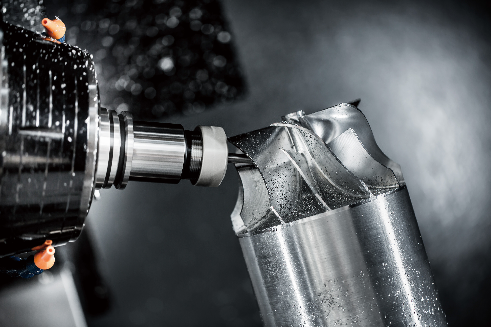
  

    
SZATech · Precision CNC Machining

    <h2>Custom Precision Parts — From Prototype to Production</h2>
    

      
Custom machining for prototypes, R&amp;D and engineering projects, low-volume production runs and repeat production.

      
Unusual and complex parts welcome. Send your drawing for a responsive engineering review.

      
In-house CMM + Projector Inspection · Flexible quantities

    

    
PrototypesR&amp;D PartsLow-Volume ProductionRepeat OrdersCustom Manufacturing

    
<a class="sza-btn sza-primary" href="mailto:steven@szatech.com">Send Drawing / Email Us</a><a class="sza-btn sza-ghost" href="#inquiry">Start an Inquiry</a>

  

</section>

  
<strong>10 Years</strong>Precision CNC experience

  
<strong>10 Machines</strong>Flexible production capacity

  
<strong>Inspection</strong>In-house CMM + projector

  
<strong>Flexible quantities</strong>From prototypes to repeat orders

<section id="about" class="sza-section">
  

    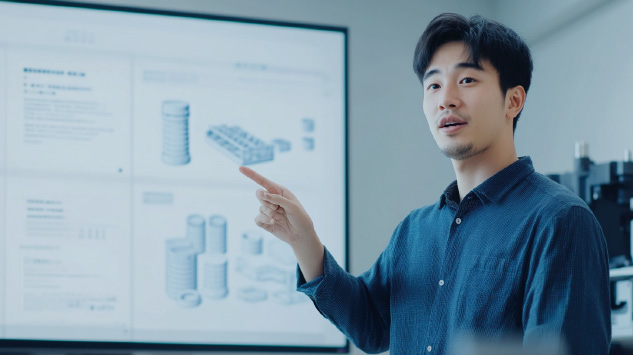
    

About SZATech

      <h3>From one-off development parts to repeat production.</h3>
      
SZATech supports custom precision parts with practical engineering communication, flexible quantities and responsive quotation. Start with a development part or a small batch, then continue into production runs as your project matures.

      
We welcome complex geometries and non-standard requirements for automation, research equipment and industrial projects. Low-volume work is a starting point, with support for ongoing production needs.

      
Engineering SupportLow-Volume ProductionRepeat Orders

    

  

</section>

<section id="capabilities" class="sza-section sza-soft">
  

    

Core Capabilities
<h2>Custom parts. Practical manufacturing support.</h2>

CNC turning and milling, sheet metal, laser cutting, plus fixtures and custom fabrication to suit your project.

    

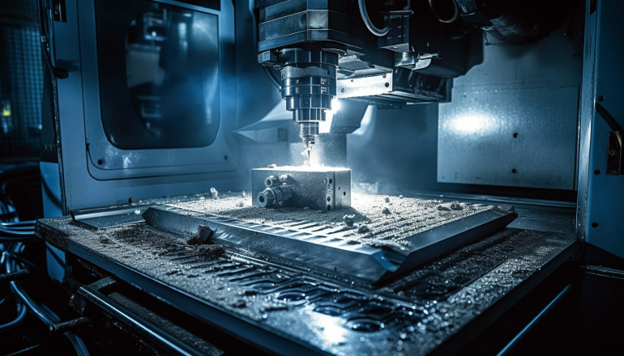CNC Milling

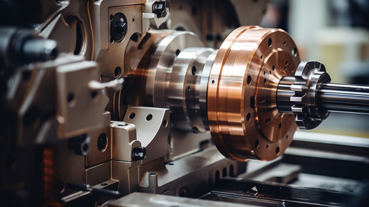CNC Turning

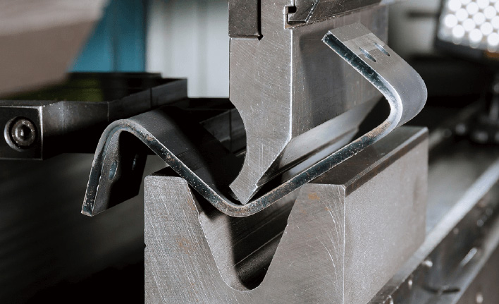Sheet Metal

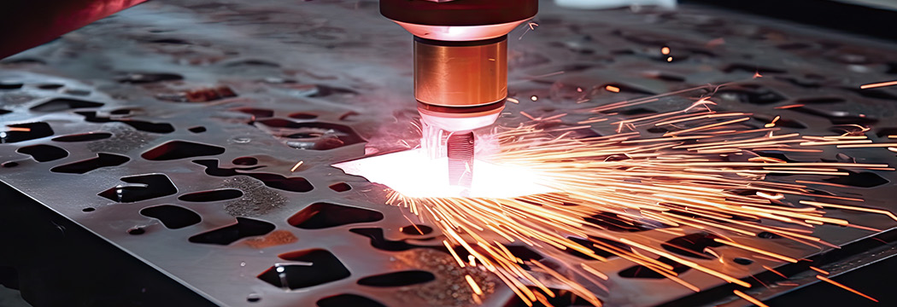Laser Cutting

    
<h3>Integrated / Partner Processes</h3>
Die casting, injection molding, forging and powder metallurgy are coordinated through manufacturing partners, based on project requirements.

    

<b>01</b>Prototype

<b>02</b>Verification

<b>03</b>Pilot Batch

<b>04</b>Repeat Production

  

</section>

<section id="case-studies" class="sza-section" aria-labelledby="case-studies-title">
  

    <h2 id="case-studies-title">Case Studies</h2>
    

      <article class="sza-case-card">
Research apparatus · United States
<h3>Non-standard parts for neuroscience research</h3>
Custom prototype parts for a non-standard experimental apparatus for a U.S. neuroscience research team. One example of the unusual custom parts we support alongside automation and production projects.
<a href="mailto:steven@szatech.com">Discuss your custom part →</a></article>
    

  

</section>

<section id="materials" class="sza-section">
  

    

      

Materials &amp; finishing
<h2>Built for the material your part demands.</h2>

      
Available materials include stainless steel, steel, titanium, aluminum, brass alloy, plastic and other metals, with a broad surface-treatment range.

    

    

      
<h3>Precision metal parts</h3>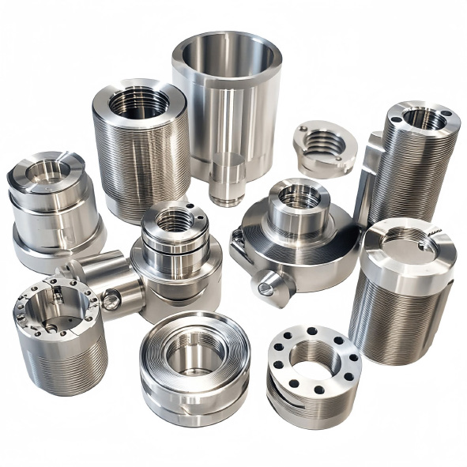
Custom components produced for different geometries, tolerances, quantities and downstream finishing requirements.

      

Stainless Steel

Steel

Titanium

Aluminum

Brass Alloy

Other Metals &amp; Plastics

    

    

    

      
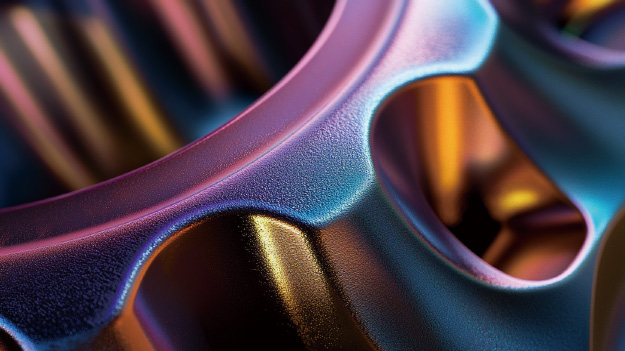Anodizing

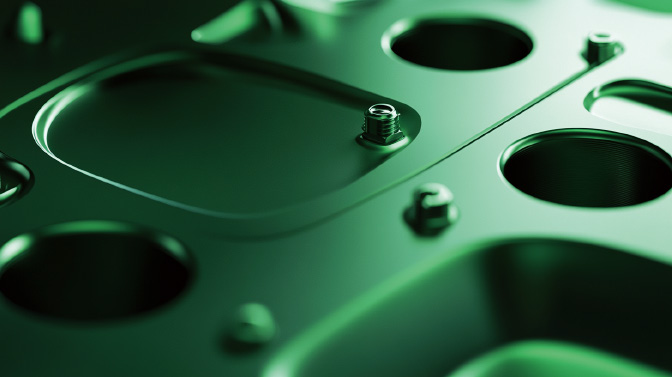Sandblasting

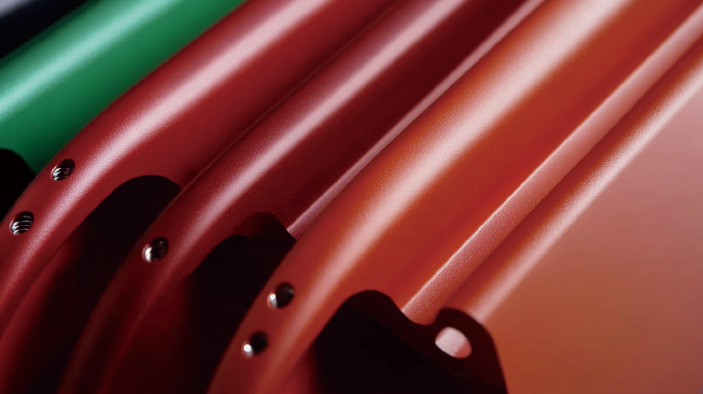Powder coating

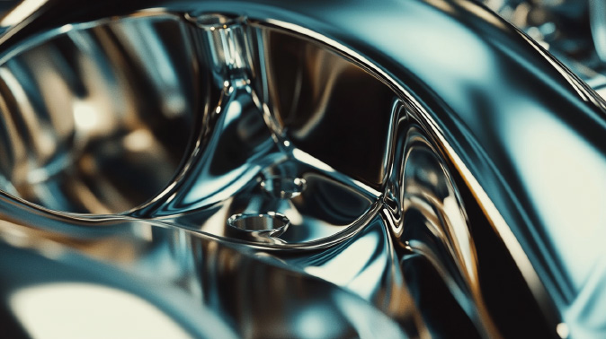Mirror polishing

      
Brushing

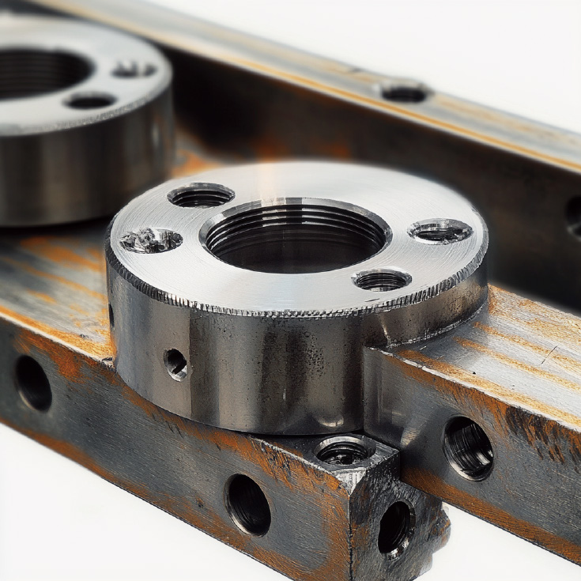As-machined

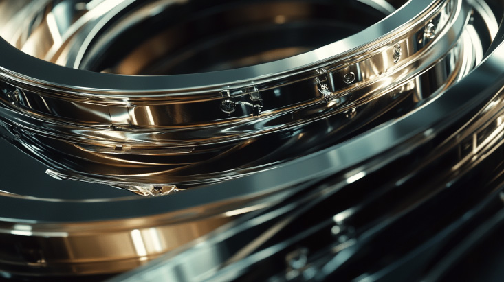Electroplating

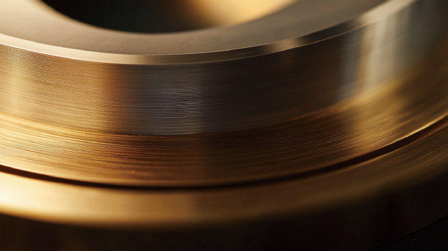Alodine

      
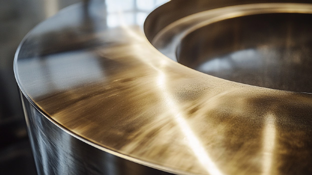Polishing

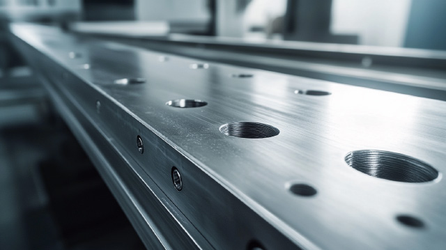Deburring

Black oxide

Spray paint

    

  

</section>

<section class="sza-section sza-soft">
  

    

Our advantages
<h2>Small enough to be responsive. Precise enough to be trusted.</h2>

Engineering capability, equipment capacity, quality control and integrated service are designed to support complex machining and reliable delivery.

    

      

<h3>Engineer-friendly communication</h3>
We respond quickly to drawings, specifications and tolerance requirements, making collaboration smoother for procurement teams and engineers.

      
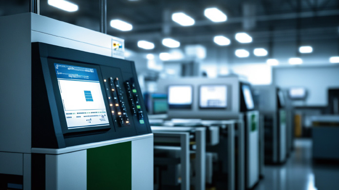
<h3>Flexible machine capacity</h3>
With 10 machines and an agile production setup, SZATech can support prototypes, small runs and repeat orders as projects move into ongoing production.

      
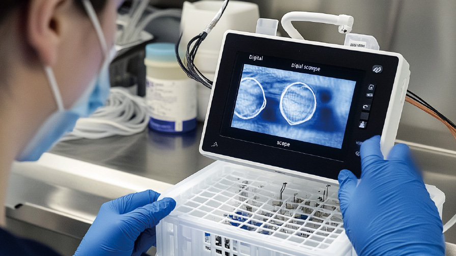
<h3>In-house quality checking</h3>
CMM and projector inspection support dimensional verification, while process control helps maintain reliable part quality.

      

<h3>Continuity from development to production</h3>
Start with development parts, verify the design and move into pilot batches and repeat orders with the same point of contact.

    

  

</section>

<section id="industries" class="sza-section">
  

Industries
<h2>Parts for development. Parts for daily operation.</h2>

Custom components for engineering teams, equipment builders and laboratories, from early development to repeat production.

    

Automation &amp; Machine Builders

Research &amp; Laboratory Equipment

Robotics

Optics / Scientific Instruments

Industrial Equipment

  

</section>

<section class="sza-section sza-soft">
  

    

Factory &amp; workflow
<h2>Real machining. Real inspection.</h2>

Production, storage and inspection images below help customers understand the actual working environment behind each order.

    
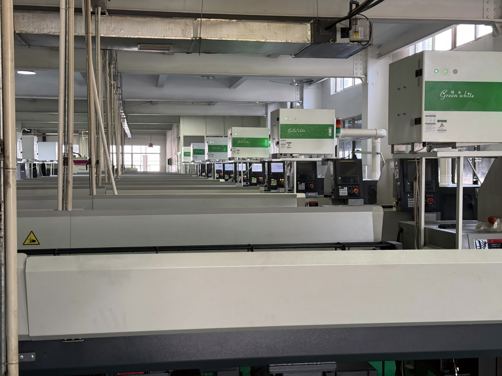
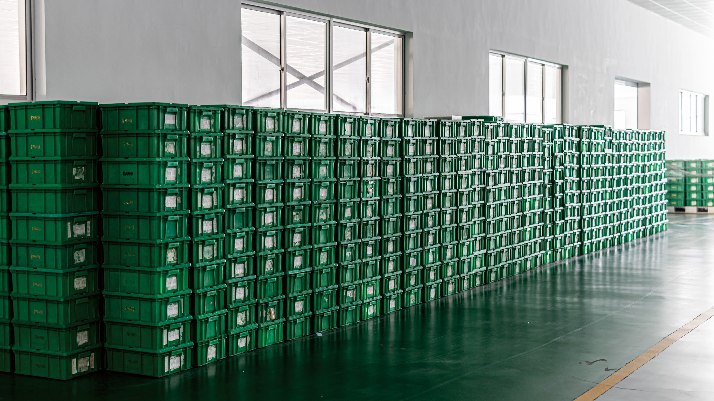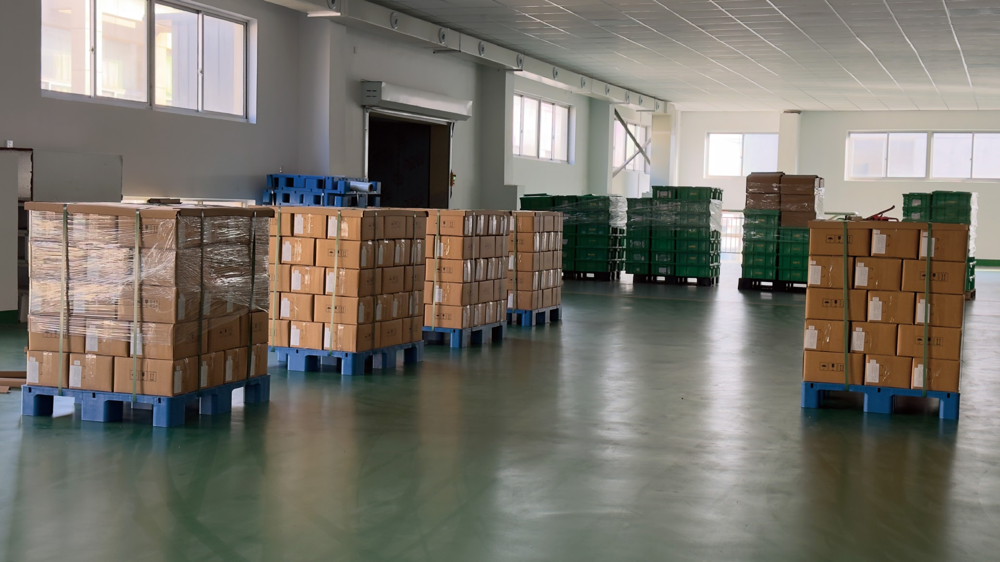

  

</section>

<section class="sza-section sza-dark">
  

    

Machines
<h2>Compact setup. Useful capacity.</h2>

Selected equipment supports precision turning, milling, machining-center work and cleaning processes.

    

      
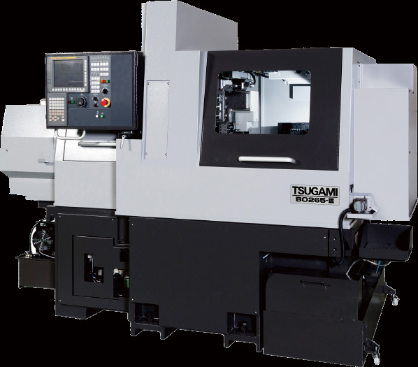<h3>CNC Precision Automatic Lathe</h3>
TSUGAMI precision automatic lathe for high-accuracy turning work.

      
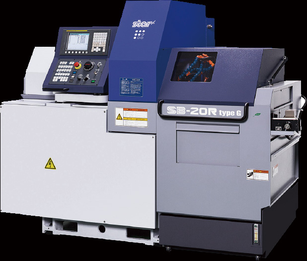<h3>Sliding Head Lathe</h3>
STAR sliding-head support for stable precision machining.

      
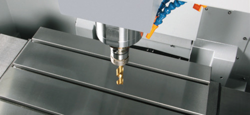<h3>CNC Machining Center</h3>
For milling and more complex geometries requiring multi-step machining.

      
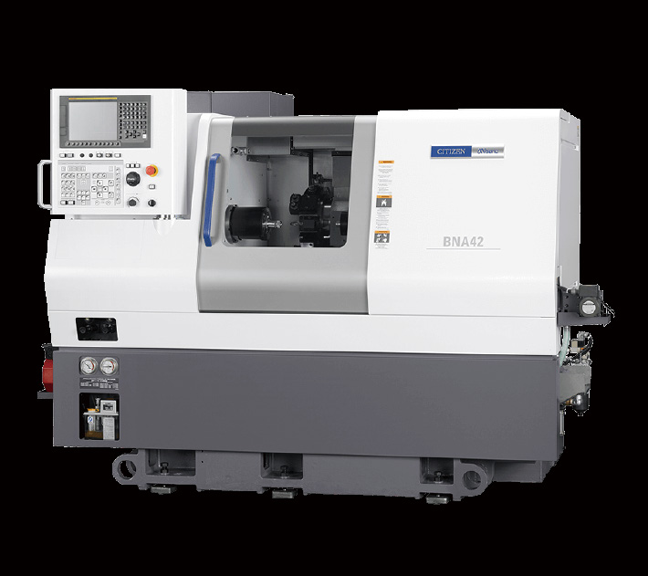<h3>Turret Lathe &amp; Cleaning</h3>
Complementary machine and cleaning capability for complete workflows.

    

    

      
<b>Machine Capacity</b>10 machines

      
<b>Typical Focus</b>Precision CNC parts

      
<b>Project Fit</b>Prototype to repeat production

      
<b>Workflow</b>Machining + finishing + inspection

    

  

</section>

<section id="quality" class="sza-section">
  

    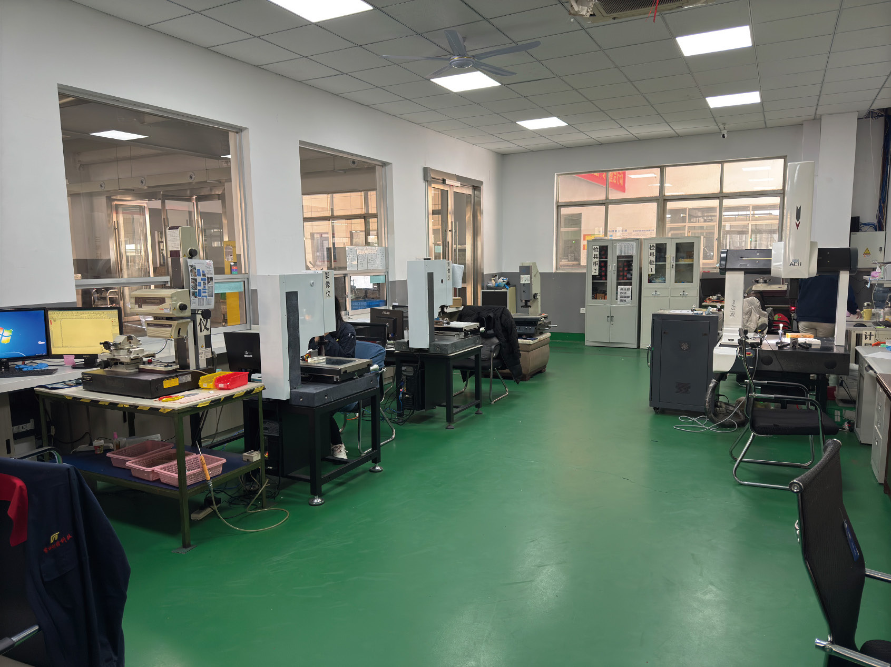
    

Measurement &amp; inspection
<h3>Inspection is part of the process, not the final step.</h3>
SZATech uses dimensional and visual inspection tools, including in-house CMM and projector inspection, to support precision requirements and customer confidence.

      

        
CMMDimensional verification

        
ProjectorProfile and feature inspection

        
Tolerance capabilityPrecision capability up to ±0.01 mm, depending on geometry, material and feature size.

        
Order modelFlexible quantities, from development to repeat production

      

    

  

</section>

<section id="contact" class="sza-section sza-contact">
  

    

Contact / RFQ
<h2>Send your drawing. Let’s review your project.</h2>
Email your drawing or tell us what you need to make. Early-stage projects and repeat production inquiries are welcome.

<a class="sza-btn sza-primary" href="mailto:steven@szatech.com">Send Drawing / Email Us</a><a class="sza-btn sza-ghost" href="#inquiry">Start an Inquiry</a>

✔ Flexible quantities✔ Precision inspection✔ Responsive engineering review

    

      
<small>Email</small><a href="mailto:steven@szatech.com">steven@szatech.com</a>

      
<small>Company</small><strong>SZATech</strong>

      
<small>Address</small><strong>Wuxi New Wu District, Zhujiang Road 49-2, Industrial Park, Building A</strong>

      
<small>Service</small><strong>Custom precision parts · Prototype to repeat production</strong>

      <h3 id="inquiry">Start an Inquiry</h3>
      
For a faster review, please include your drawing/specification, target quantity and delivery timing if available.

      <form class="sza-form" aria-describedby="inquiry-help inquiry-note" onsubmit="return openSzaInquiry(event, 'en')">
        
<label for="rfq-name">Name*</label><input id="rfq-name" name="name" required autocomplete="name">

<label for="rfq-company">Company (optional)</label><input id="rfq-company" name="company" autocomplete="organization">

<label for="rfq-product">Part / Product*</label><input id="rfq-product" name="product" required>

        
<label for="rfq-message">Requirements / Notes (optional)</label><textarea id="rfq-message" name="message" placeholder="Tell us about your project. Include quantity or timing if known."></textarea>

        
Opens a draft in your email app. Attach drawings if available, then send your email. Your details are not stored on this website.

        
<button type="submit" class="sza-btn sza-blue-button">Start an Inquiry</button><button type="button" class="sza-btn sza-outline" data-copied="Email copied" onclick="copySzaEmail(this)">Copy email address</button>

      </form>
    

  

</section>

SZATech Custom precision machining · Prototype to repeat production Wuxi New Wu District, Zhujiang Road 49-2, Industrial Park, Building A

